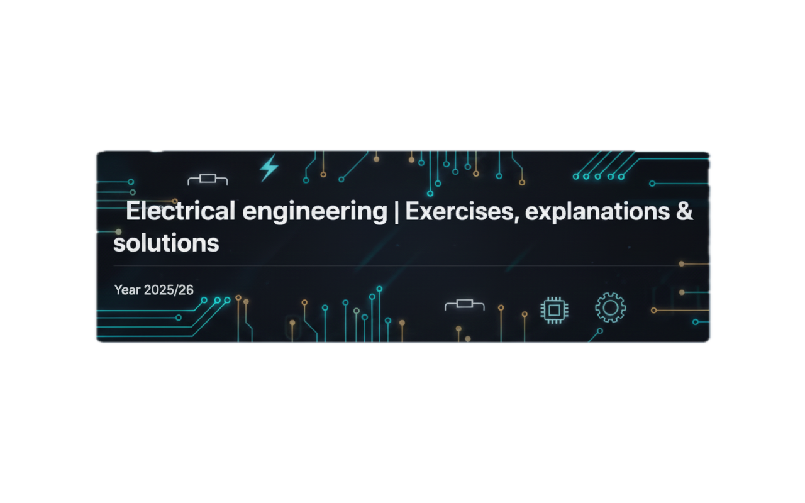

## 📖 About this repository
Welcome to the epicenter of electrical engineering!
Here we archive everything that worked in class—and sometimes even what didn't.

* **Goal:** Find tasks faster than the Arduino boots up.
* **Format:** Code, explanations, and images so that even the LED knows what to do.
* **Get involved:** If you can do it better: Pull Request → Become a legend 😎

---

## 📂 Overview of topics

| Topic | Status |
| :--- | :---: |
| **Binary clock** | ✅ Done |
| **Exam 1** | ✅ Done |
| **Traffic light circuit** | ✅ Done |
| **TimerOne** | ✅ Done |
| **DHT11, GY-21, Thermistor & OLED Display** | ✅ Done |
| **PWM, AD Converter & Potentiometer** | ✅ Done |
| **DC motor** | ✅ Done |
| **Servo motor & stepper motor** | 🚧 In progress |
| **Exam 2 Preparation** | 🚧 In progress |
| **Exam 2** | 📅 Planned |

---

## Author

- [@Kraptukrait](https://www.github.com/Kraptukrait)

